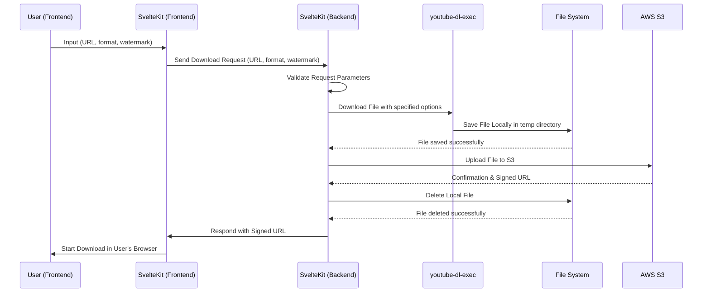

# downloadthing

downloadthing is a robust, user-friendly application that allows you to download media from various platforms seamlessly.

Supported Sites:

- Youtube
- Twitter
- Instagram (reels only)
- Tiktok
- Soundcloud
- Twitch (clips and VODs only)
- Rumble

Try it here https://gursheys.com/downloadthing

## Diagram



## Prerequisites

To successfully deploy and run this project, you'll need to create an Amazon S3 bucket and set up your access keys. If you haven't done so yet, please follow the official AWS guides:

- [Creating an S3 bucket](https://s3.console.aws.amazon.com/s3/home?region=us-east-1)
- [Setting up your AWS access keys](https://docs.aws.amazon.com/IAM/latest/UserGuide/id_credentials_access-keys.html?icmpid=docs_iam_console#Using_CreateAccessKey)

The following environment variables must be set:

- `AWS_ACCESS_KEY_ID`: Access key associated with your AWS account
- `AWS_SECRET_ACCESS_KEY`: Secret key associated with your AWS account
- `BUCKET_NAME`: The name of the S3 bucket you wish to use for this project
- `AWS_REIGON`: [Region](https://docs.aws.amazon.com/AmazonRDS/latest/UserGuide/Concepts.RegionsAndAvailabilityZones.html) of your S3 bucket

## Local Setup

To get started with the setup, clone the repository and navigate into the directory using the following commands:

```bash
git clone https://github.com/gursheyss/downloadthing
cd downloadthing
```

Once you're inside the project directory, install the project dependencies with:

```bash
pnpm install
```

To run up a development environment, run:

```bash
npm run dev
```

## Deployment

To prepare the application for deployment, run:

```bash
npm run build
```

When deploying to a server, it's crucial to install the exact dependencies specified in the lockfile. This ensures the server environment mirrors your local development environment as closely as possible. To achieve this, run:

```bash
pnpm install --frozen-lockfile
```

That's it! You're now ready to enjoy seamless media downloads with Download AIO.

## Questions or Issues?

If you encounter any problems with deployment or use of this application, please feel free to [open an issue](https://github.com/gursheyss/download-aio/issues) on GitHub.
